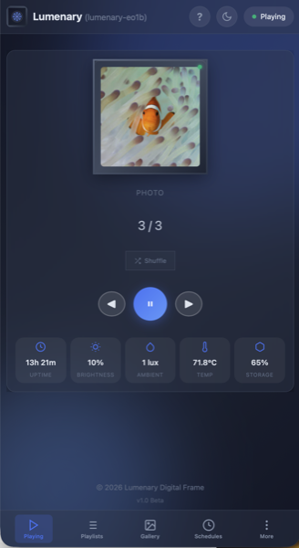

# Lumenary for Electric Objects EO1

<p align="center">
  
</p>

Lumenary was originally written for Raspberry Pi, but I wanted to get my Electric Objects EO1 frames back online. This EO1 port is an offshoot—I'm still developing the Pi version. Revive your EO1 with smooth transitions, video playback, and web-based controls.

> **Raspberry Pi version** — Not yet released, but [lumenary-pi](https://github.com/RichN001/lumenary-pi) has info and will house the Pi build when ready.


**Download: https://lumenary.logiwrx.net/releases/eo1-lumenary-usb-v0.9.0.img.gz

> **Beta Release** — EO1 support is fully tested but this is a beta release. If you encounter bugs, please [open an issue](https://github.com/RichN001/lumenary-eo1/issues) so we can track and fix them.

> **EO2 Note:** Untested. May have different hardware. Use "Try Lumenary" from recovery USB to test without modifying your device.


## Tech Stack

Lumenary is written in **C++** with the following stack:

| Component | Technology |
|-----------|------------|
| Graphics | OpenGL ES 2.0 via EGL |
| Display | fbdev (Vivante GC2000) |
| Video decode | GStreamer + i.MX6 VPU (imxvpudec) |
| Web server | Embedded HTTP (cpp-httplib) |
| Database | SQLite |
| Text rendering | FreeType |
| Image processing | libjpeg, libpng, libexif |

## What Works

| Feature | Status | Notes |
|---------|--------|-------|
| Photo slideshow | ✅ | Smooth crossfade, slide, wipe, zoom transitions |
| Video playback | ✅ | Hardware VPU decode, H.264/MP4 |
| Animated GIFs | ✅ | Auto-converted to MP4 on upload |
| USB Gallery | ✅ | Load photos/videos from USB drive (NEW) |
| Ken Burns effect | ✅ | Subtle pan/zoom animation |
| Web UI | ✅ | Upload, drag-drop reorder, configure settings |
| Auto-brightness | ✅ | APDS9300 light sensor (if present on your unit) |
| Hardware brightness | ✅ | PWM backlight control (0-100%) |
| Night mode | ✅ | Dims display during set hours |
| Clock overlay | ✅ | FreeType 60fps native rendering |
| WiFi setup | ✅ | Captive portal AP mode for easy configuration |
| mDNS | ✅ | Access via `lumenary-XXXX.local` |
| Tailscale VPN | ✅ | Optional secure remote access |
| Cloud access | ✅ | Remote control via lumenary.logiwrx.net |

## Limitations

| Feature | Status | Reason |
|---------|--------|--------|
| Video transitions | ❌ | GStreamer takes over framebuffer directly |
| Face-aware cropping | ❌ | OpenCV 4.5+ required (EO1 has 3.2) |
| HTTPS/SSL | ❌ | OpenSSL 3.0+ required (EO1 has 1.1) |
| Chromium widgets | ❌ | Too slow on i.MX6, uses native clock instead |
| Motion sensor | ❌ | No PIR hardware on EO1 |
| MQTT/Home Assistant | ⚠️ | Works but needs external broker configured |
| Cap touch buttons | ⚠️ | Implemented but disabled (investigating CPU overhead) |

## Hardware

- **SoC**: NXP i.MX6 Dual @ 1GHz
- **RAM**: 1GB DDR3
- **Storage**: 4GB eMMC
- **Display**: 1920x1080 LVDS panel
- **GPU**: Vivante GC2000 (fbdev mode)
- **Video**: i.MX6 VPU hardware H.264 decode

## Installation

### Requirements
- Electric Objects EO1 frame (EO2 untested)
- USB drive (8GB or larger **required** — trial mode and master image are large; backups need the space)
- Micro-USB OTG adapter
- Computer with [Etcher](https://etcher.balena.io/)

### Steps

1. **Download** the latest recovery image from [Releases](https://github.com/RichN001/lumenary-eo1/releases)

2. **Flash** the image to USB drive using Etcher

3. **Connect** USB drive to EO1 via micro-USB OTG adapter

4. **Boot** the frame (both DIP switches OFF)

5. **Connect** your phone to the `LumenarySetup` WiFi network

6. **Open** http://192.168.4.1 in your browser

7. **Choose** installation option:
   - **Try Lumenary** — Run from USB without modifying eMMC
   - **Backup + Install** — Save Android, then install Lumenary
   - **Install Only** — Erase and install (no backup)
   - **Backup Only** — Save Android to USB for safekeeping

8. **Wait** ~10-15 minutes for installation to complete

9. **Remove** USB and power cycle the frame

## First Boot Setup

After installation, the frame boots into **AP mode** and creates a WiFi network called `Lumenary_XXXX` (no password).

### Connecting to Your Home WiFi

1. Connect your phone to the `Lumenary_XXXX` WiFi network
2. Open http://192.168.4.1 in your browser
3. Go to **Network** in the web UI
4. Scroll down to **"Connect Manually"**
5. Enter your WiFi **SSID** and **Password**
6. Tap **Connect**

**If connection fails:** The frame's AP will restart — reconnect to `Lumenary_XXXX` and try again. Double-check your WiFi password.

**If connection succeeds:** The IP address will briefly appear on the frame display. Access the web UI at http://[IP] or http://lumenary-eo1.local

**You can also use the frame in AP mode** without connecting to home WiFi — just stay connected to `Lumenary_XXXX` and use http://192.168.4.1 to upload photos and control the slideshow.

## Web Interface

Access the web UI from any device on your network to:
- **Upload** photos, videos, and GIFs (drag & drop)
- **Create** playlists and schedules
- **Configure** slideshow timing and transitions
- **Adjust** brightness (manual or auto)
- **Set** night mode hours
- **Customize** clock overlay appearance
- **Connect** to cloud for remote access

### Save to Phone as App

You can add the Lumenary web UI to your phone's home screen for quick access—it works like a native app:

**iPhone (Safari):**
1. Open the web UI in Safari (e.g. http://192.168.4.1 or http://lumenary-eo1.local)
2. Tap the **Share** button (square with arrow)
3. Scroll down and tap **Add to Home Screen**
4. Edit the name if desired, then tap **Add**

**Android (Chrome):**
1. Open the web UI in Chrome
2. Tap the **⋮** menu
3. Tap **Add to Home screen** or **Install app**
4. Confirm the name and tap **Add**

Once added, the Lumenary icon appears on your home screen. Tap it to open the control panel without opening a browser first.

## Remote Access

### Cloud Tunnel (Easy)
1. Go to Settings > Cloud in the web UI
2. Enable cloud access
3. Access your frame at https://lumenary.logiwrx.net

### Tailscale VPN (Private)
1. Go to Settings > Cloud/VPN in the web UI
2. Click "Install Tailscale"
3. Click "Connect" and authenticate
4. Access your frame via Tailscale IP

## SSH Access

```bash
ssh lumenary@192.168.x.x
# Password: lumenary123
```

## Troubleshooting

### Frame stuck at boot logo
- Ensure USB is connected via OTG adapter
- Try a different USB drive (some aren't bootable)
- Verify both DIP switches are OFF

### Can't find setup WiFi
- Wait 60 seconds after power on (WiFi is slow to start)
- Look for `Lumenary_XXXX` or `LumenarySetup`

### Web UI won't load
- Try http://192.168.4.1 (in AP mode)
- Try http://lumenary-eo1.local (after WiFi setup)
- Check IP address on frame display

### Video won't play
- Ensure H.264 codec (not H.265/HEVC)
- Keep videos under 1080p
- Short clips work best (< 2 minutes)

### Brightness not changing
- Light sensor may not be present on your unit
- Use manual brightness mode in web UI
- Check Settings > Display > Brightness Mode

## Restoring Android

If you created a backup during installation:

1. Boot from USB recovery drive
2. Connect to `LumenarySetup` WiFi
3. Open http://192.168.4.1
4. Select "Restore" and choose your backup file
5. Wait for restore to complete (~10 min)
6. Remove USB and power cycle

## License

MIT License — See [LICENSE](LICENSE) for details.

## Acknowledgments

- Electric Objects for the original hardware
- Boundary Devices for Linux kernel support
- The EO1 community for keeping these frames alive
